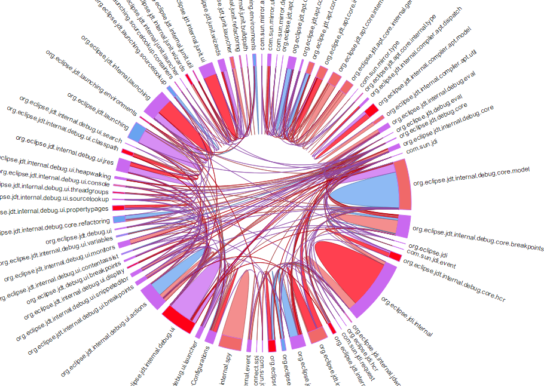
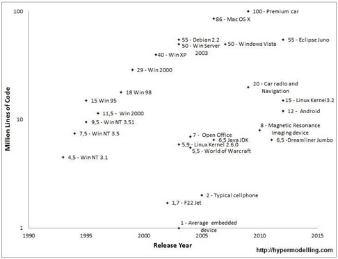

<h1>Source Code Dependency Analysis with Chord Diagrams</h1>
<h3>The Chord Code Coupling Detector (CCCD) / Wheel of Fortune</h3>

By  Tim Frey, Christian Schmitt and Ulrich Keil

This project is a proof of concept to demonstrate the advantages of a visual chord-diagram based investigation of software dependencies. The goal is to show that this graphical representation enables to detect and to analyze a program without having to know the implementation details on a detailed source code level. The application of the project can be used for business cases like quality gates or to plan refactorings to decouple or rearrange packages.  

**Contents**
- Motivation
- Approach
- Demo 
- Feature Description
- How to use your own projects / Other CSV file loading
- Acknowledgement 
- Related Work/Similar projects

<h1>Motivation</h1>

			

Computer programs run on plenty of devices. Their source code is growing into several million lines of code. Investigating dependencies in computer programs is, and gets more and more, complex. This project for dependency analysis with chord diagrams is a complete Javascript solution to leverage the power of chord diagrams to analyze the dependencies of programs in a top down approach. This way, investigations of the dependencies of program components can be done in a visual and intuitive way.

The data origin for the <a href="http://iunera.com/codedependencywithchord/index.html"
		>demo diagram</a> were created by computing coupling indicators of the <a href="http://http://www.eclipse.org/jdt/">Eclipse Java development tools (JDT)</a> with the <a href="http://hypermodelling.com">Hypermodelling</a> technology. Thereby, the coupling indicators are loaded from CSV data files into the diagram (see the csv files in the source folder as example to generate your own). The CSV approach enables to use other CSV data with the Javascript frontend.

<h1>Approach</h1>	

We compute the amount of method class of one Java package to another. We do this for the package hierarchy of a Java program. This means we compute it for org.eclipse, org.eclipse.jdt, org.eclipse.jdt.core and so on and so forth. We arrange the amount which package calls which package in several a comma separated value (csv) files. Then we use these csv files to feed a Javascript chord diagram with the data. The chord diagrams gets some additional controls to let the user navigate and explore the dependencies based on method calls then. 

<h1>Demo</h1>

Live demo:
<a href="http://iunera.com/codedependencywithchord/index.html">http://iunera.com/codedependencywithchord/index.html</a>

Find a demo usage video here:
<a href="https://youtu.be/RjKhw7qALhg">https://youtu.be/RjKhw7qALhg</a>

 

				
			
<h1>Features</h1>

The current solution visualizes dependencies source code with a chord diagram. Thereby, the diagram uses different features to enable a smooth navigation though the dependencies. In special, the main features are:

<b>Permanent marking</b>

The user can select software components and the highlighting (just click the border) is done in a permanent way and not faded away once the hover pointer gets moved away. A special feature of the permanent highlighting is that the connected components that are not activated permanently but that are connected to a highlighted component get faded partially. This way, the user can distinguish selected and connected elements, because the selected ones get shown not faded at all and the just connected ones get shown partially.

<b>Dependency intensity visualisation</b>

The dependency intensity gets visualized in a graphical manner by showing different thick connections

<b>Faded association highlighting</b>

Selected system components lead to a highlighting of the associated dependencies and the components they lead to

<b>Hover tooltips</b>

Tooltips get shown once a dependency gets selected, showing details about the intensity

<b>Drill-Downs</b>

Drill downs enable to get insights of selected component data and their inner dependencies at multiple levels

<b>Url parameter diagram state</b>

The state of the visualization is stored in URL parameters to enable forwarding an investigation result to other people via a hyperlinks.

		
<h1>How to use your own CSV dependency files</h1>

You can use this index.html in the src folder for other CSVs as well. Just compute your own dependencies for the CSV or enter them manually. Then just load it by index.html?file=mydata.csv . 

In case you want to enlist your project then in our chord, just email the url and so on to <a
				href="mailto:chordcodeanalytics@iunera.com?subject=Feedback%20for%20Code%20Dependency%20Analysis%20with%20Chord%20Diagrams&amp;body=Hi%0D%0Atell%20us%20about%20%20your%20impression%20and/or%20rate%20the%20chord%20analysis%20solution%20in%20respect%20to%20analyze%20a%20large%20program%0D%0A(scale:1-6/1=bad/6=good).">chordcodeanalytics(at)iunera.com</a> or send a push request with the CSV data if you want to include data. 

<b>Remark:</b> If you copy start the script locally with a browser without a webserver (e.g. file:/// and not http://) it is likely the case that you have to turn off the same origin policy of the browser. The other way to get around the same origin pilicy is to let it run on a webserver and upload the csv there. 
 

 

<b>Description of the csv data - example in ./src/jdt.csv</b>  

The headers of the csv have to contain the following labels "creditor,debtor,amount,risk". 

"Creditor" is the outgoing dependency root (caller).  
"Debtor" is where the dependency is heading to (callee).  
"Amount" is the intensity of the dependency (how often is it called). 
"Risk" is the value of another strength dimension of a dependency that gets used for coloring if available ( In the example the amount is the number of method calls and risk the number of distinct called java types(classes, interfaces, Enums)).

<b>Drilldown files: </b>

When you add a "mydata_drilldown" file it has to be named as the parent file (mydata.csv) with "_drilldown" appended in the filename. E.g.:"jdt.csv->jdt_drilldown.csv".

The labels in a drill-down file (jdt_drilldown.csv) have to be named "topcreditor, topdebtor, creditor, debtor, amount, risk", whereby the topcreditor and topdebtor have to correspond to the "creditor" and "debtor" in the parent file (jdt.csv). The "topcreditor and topdebtor" are needed for the relation to the parent compontents.

Creditor and debtor and in the drilldown file represent the children objects of the parents. You can add another depth dimension with a "drilldown_drilldown.csv" file naming (e.g. jdt.drilldown_drilldown.csv) then the topcreditor and topdebtor correspond to the debtor and creditor of the superior level "_drilldown" file (jdt_drilldown.csv).

E.g. jdt.csv creditor and debtor get topcreditor and topdebtor in jdt_drilldown.csv. The creditors and debtors in the jdt_drilldown.csv get themselves then the topcreditors and topdebtors in jdt_drilldown_drilldown.csv.

		
<h1>Background - Idea origin</h1>

 A software architecture goal to create reliable and reusable software artifacts is to develop loosely coupled software components. Furthermore, strong source code dependencies inflict source reuse and engineering problems.

However, even that it is well-known that restricting dependencies is a good thing, software engineers often cannot avoid them when manufacturing systems in the first place. Commonly, a software system is developed by iterative steps and the dependencies grow in the continuous development process. This results in the process that the dependencies have to be maintained over time and refactoring steps have to be taken to manage and reduce dependencies over time. Once the development of code foundation of a software system grows, the management of dependencies gets more and more complex.

In order to reduce dependencies, developers need to know which artifacts consume other artifacts. Today, mostly this work is done by inspecting the source code manually. Usually the developers tediously gather the artifacts that belong to the desired dependencies and then try to reduce them. 

Additionally, software and their dependencies are multi-dimensional construct and manifold what makes the inspection even more difficult.
When we saw complex chord diagrams about the financial crisis <a href="http://bl.ocks.org/mbostock/1308257">(check it here)</a> we got motivated us to use chord diagrams to investigate software dependencies in a visual manner.

<h1>Similar Projects</h1>

If you want to have a similar project that you know have enlisted here. Please drop us an email with the project and describe the relation/key similarities or differences.  <a
				href="mailto:chordcodeanalytics@iunera.com?subject=Feedback%20for%20Code%20Dependency%20Analysis%20with%20Chord%20Diagrams&amp;body=Hi%0D%0Atell%20us%20about%20%20your%20impression%20and/or%20rate%20the%20chord%20analysis%20solution%20in%20respect%20to%20analyze%20a%20large%20program%0D%0A(scale:1-6/1=bad/6=good).">chordcodeanalytics(at)iunera.com</a>

<b>DependencyWheel</b>

A Similar project that we found is <a href="http://www.redotheweb.com/DependencyWheel/">DependencyWheel: An Interactive Visualization Of Package Dependencies by François Zaninotto</a>. It is a really great tool to visualize PHP dependencies. Main differences that we recognized are: Connection intensity does not get visualized in the connection strength; No permanent marking of components to activate the cyclic dependencies step by step; No drilldowns; No tooltips

<b>A Visual Analysis Approach to Support Perfective Software Maintenance</b>

Another similar project is: <a href="http://www.youtube.com/watch?v=4rkgfRaCS20">A Visual Analysis Approach to Support Perfective Software Maintenance by Jonas Trümper and Martin Beck and Jürgen Döllner in Proceedings of the 16th International Conference on Information Visualisation, IEEE</a>. The main differences that we recognized are:  Not running in the browser/ no url params Differences and related visualizations that we found so far; Connection intensity does not get visualized in the connection strength; Step by step dependency investigations by clicking components and fading is not possible in the way we do it; Drill downs or filtering the current selection seems not possible  

<b>Hypermodelling</b> 

The <a href="http://hypermodelling.com">Hypermodelling</a>  technique is a generic approach to analyze source code with Data Warehouses <a href="http://accepted.hypermodelling.com/frey_magdeburg_dissertation_hypermodelling_2013.pdf"
		>(find the free ebook here)</a>. The relation to the chord visualisation is that Hypermodelling was used to compute the CSVs that served as data source for the visualisation. We remark that those CSVs can also be computed by other techniques. In this context it is also noteworthy that we also computed CSVs for class inheritance and other means of couplings as first test and the chord diagrams seem to work well for those, too. However, they are harder to interpret what set our focus to method calls.   

		

<h1>Acknowledgement</h1>	

			This project was realized by the help of members of the following projects and would not have be possible without them: 

		
		 
			
		
		
		

